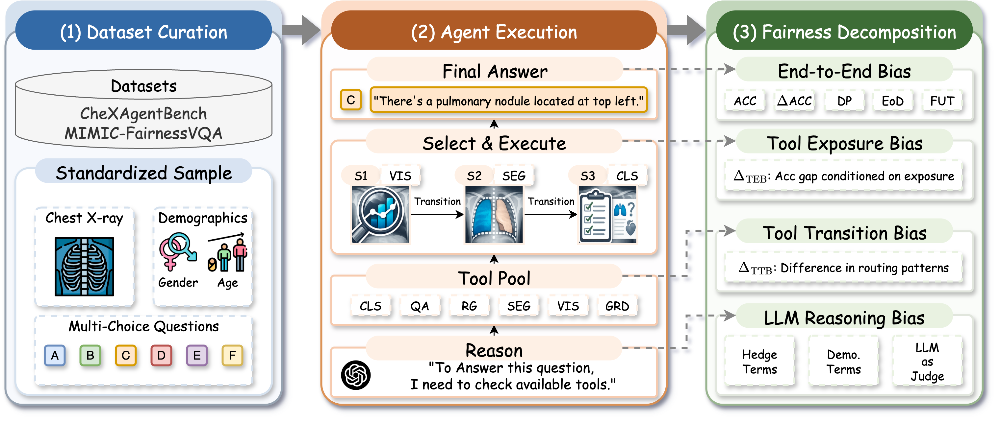

<div align="center">

# 🏥 DUCK: Decomposing Unfairness in Tool-Using Chest X-ray Agents

<a href="https://arxiv.org/abs/2603.00777"></a>
<a href="https://opensource.org/licenses/Apache-2.0"></a>
<a href="https://2026.miccai.org/"></a>
<a href="https://www.python.org/downloads/"></a>

Zikang Xu<sup>1*</sup> · Ruinan Jin<sup>2,3*</sup> · Xiaoxiao Li<sup>2,3†</sup>

<sup>1</sup> Institute of Artificial Intelligence, Hefei Comprehensive National Science Center  

<sup>2</sup> The University of British Columbia  

<sup>3</sup> Vector Institute  

<sup>*</sup> Equal contribution  

<sup>†</sup> Corresponding author

[📄 Paper](https://arxiv.org/abs/2603.00777) · [🤗 Data](#) · [📊 Quickstart](notebooks/DUCX_quickstart.ipynb)

</div>

---



## 📖 Abstract

> Tool-using medical agents can improve chest X-ray question answering by orchestrating specialized vision and language modules, but this added pipeline complexity also creates new pathways for demographic bias beyond standalone models. We present **DUCX** (**D**ecomposing **U**nfairness in **C**hest **X**-ray agents), a systematic audit of chest X-ray agents instantiated with MedRAX. To localize where disparities arise, we introduce a stage-wise fairness decomposition that separates *end-to-end bias* from three agent-specific sources: *tool exposure bias* (utility gaps conditioned on tool presence), *tool transition bias* (subgroup differences in tool-routing patterns), and *model reasoning bias* (subgroup differences in synthesis behaviors). Extensive experiments on tool-used based agentic frameworks across five driver backbones reveal that **(i)** demographic gaps persist in end-to-end performance, with equalized odds up to 20.79\%, and the lowest fairness-utility tradeoff down to 28.65\%. **(ii)** intermediate behaviors, tool usage, transition patterns, and reasoning traces exhibit distinct subgroup disparities that are not predictable from end-to-end evaluation alone (e.g., conditioned on segmentation-tool availability, the subgroup utility gap reaches as high as 50\%). Our findings underscore the need for process-level fairness auditing and debiasing to ensure the equitable deployment of clinical agentic systems.

## ✨ Highlights

- 🔬 **First fairness audit** of tool-using chest X-ray agents
- 🧩 **Three-lens decomposition**: tool exposure bias → tool transition bias → LLM reasoning bias
- 🏷️ **Two datasets**: ChestAgentBench (EuroRAD) + our new **MIMIC-FairnessVQA** benchmark
- 🧠 **Five driver LLMs**: LLaMA3.1-8B, Ministral-3-8B, Qwen3VL-8B, Qwen3-8B, Gemini3-Flash
- 📊 Rich outputs: subgroup accuracy, demographic parity, equalized odds, fairness-utility tradeoff, and per-lens decomposition tables

## 🚀 Installation

```bash
# Create conda environment
conda env create -f environment.yml
conda activate ducx

# Optional: local LLM serving via vLLM
pip install vllm

# Optional: native Gemini tool-calling
pip install -e ".[gemini]"
```

```bash
# Prepare directories
mkdir -p data/chestagentbench data/mimic figures logs model-weights temp
```

## 📦 Data

| Dataset | Description | Files |
|---------|-------------|-------|
| **ChestAgentBench** | Multi-choice CXR QA from EuroRAD | `metadata.jsonl` · `eurorad_metadata.json` |
| **MIMIC-FairnessVQA** | Our fairness-annotated VQA benchmark | `medrax_input_all_2000.jsonl` · `mimic_sample_400.csv` |

ChestAgentBench metadata is available from [MedRAX](https://github.com/bowang-lab/MedRAX/tree/main/data). MIMIC-FairnessVQA subset is provided in this release. See [`data/README.md`](data/README.md) for schema details and download instructions. A format example is included at `data/mimic-fairnessVQA_example.jsonl`.

> ℹ️ **Note**: MIMIC-CXR images must be obtained from [PhysioNet](https://physionet.org/content/mimic-cxr/). The agent requires GPU-backed chest X-ray tools — model weights are downloaded automatically on first use to `model-weights/`.

## 🏃 Quick Start

<details>
<summary><b>Colab-ready notebook</b></summary>

```bash
notebooks/DUCX_quickstart.ipynb
```

Covers environment setup, a dry-run, a full agent run, and analysis in one workflow.
</details>

### 1. Start a local LLM server (e.g., Qwen3-VL-8B)

```bash
CUDA_VISIBLE_DEVICES=0 python -m vllm.entrypoints.openai.api_server \
  --model Qwen/Qwen3-VL-8B-Instruct \
  --served-model-name qwen3-vl-8b \
  --port 8000 \
  --gpu-memory-utilization 0.9 \
  --enable-auto-tool-choice \
  --tool-call-parser hermes
```

```bash
export OPENAI_BASE_URL="http://localhost:8000/v1"
export OPENAI_API_KEY="EMPTY"
export OPENAI_MODEL="qwen3-vl-8b"
```

### 2. Run agent evaluation

```bash
# ChestAgentBench
python launch_over_chexbench.py \
  --model "${OPENAI_MODEL}" \
  --model-dir ./model-weights \
  --temp-dir ./temp \
  --data-file data/chestagentbench/metadata.jsonl \
  --device cuda \
  --log-prefix qwen3vl8b-vllm \
  --llm-parse

# MIMIC-FairnessVQA
python launch_over_chexbench.py \
  --model "${OPENAI_MODEL}" \
  --model-dir ./model-weights \
  --temp-dir ./temp \
  --data-file data/mimic/medrax_input_all_2000.jsonl \
  --device cuda \
  --log-prefix qwen3vl8b-vllm-mimic \
  --llm-parse
```

Logs are written to `logs/<log-prefix>/`.

### 3. Run fairness analysis

```bash
# ChestAgentBench
python analysis/fairness_posthoc.py \
  --log-path logs/qwen3vl8b-vllm/<run_log>.json \
  --meta-q-path data/chestagentbench/metadata.jsonl \
  --meta-case-path data/eurorad_metadata.json \
  --out-dir logs/chexagentbench/analysis/qwen3vl8b-vllm/fairness_posthoc \
  --enable-llm-judge

# MIMIC-FairnessVQA
python analysis/fairness_posthoc.py \
  --log-path logs/qwen3vl8b-vllm-mimic/<run_log>.json \
  --meta-q-path data/mimic/medrax_input_all_2000.jsonl \
  --meta-case-path data/mimic/mimic_sample_400.csv \
  --out-dir logs/mimic/analysis/qwen3vl8b-vllm/fairness_posthoc \
  --enable-llm-judge
```

Set `DEEPSEEK_API_KEY` (or configure `--judge-model`, `--judge-base-url`, `--judge-api-key-env`) for the LLM judge used by `--enable-llm-judge`.

## 🔍 Fairness Decomposition

DUCX decomposes agent unfairness through three lenses:

| Lens | What it measures | Key outputs |
|------|-----------------|-------------|
| **Tool Exposure Bias** | Do tools benefit different demographic groups equally? | `lens_agentic_conditional_tool_utility.csv` · `_gap.csv` |
| **Tool Transition Bias** | Does the agent route groups through different tool sequences? | `lens_agentic_transition_rates_by_group.csv` · `_divergence.csv` |
| **LLM Reasoning Bias** | Does final synthesis quality differ across groups? | `lens_llm_reasoning_bias.csv` · judge scores |

All outputs are under the analysis `--out-dir`, including `group_performance.csv`, `summary_report.md`, and optional bootstrap confidence intervals.

## 🖥️ Gradio Demo

Launch the interactive chat interface with chest X-ray tools:

```bash
python main.py
```

Opens on `http://0.0.0.0:8585`. Supports image upload, DICOM processing, and real-time tool execution with streaming responses.

## 🧪 Supported Driver LLMs

| Model | Backend | Notes |
|-------|---------|-------|
| Qwen3-VL-8B | vLLM (OpenAI-compatible) | Requires `--tool-call-parser hermes` |
| LLaMA 3.1-8B | vLLM or OpenAI-compatible | Text-only; image paths passed as context |
| Ministral-3-8B | OpenAI-compatible | Tool-capable |
| Qwen3-8B | OpenAI-compatible | Text-only variant |
| Gemini 3 Flash | Native (`--gemini-native`) | Requires `GEMINI_API_KEY` |

Use `--model`, `OPENAI_BASE_URL`, and the Gemini flags in `launch_over_chexbench.py` to switch backends.

## 📁 Repository Structure

```
.
├── launch_over_chexbench.py   # Main agent evaluation script
├── main.py                    # Gradio chat interface
├── interface.py               # Gradio UI implementation
├── medrax/
│   ├── agent/agent.py         # LangGraph agent with tool-calling loop
│   ├── tools/                 # 9 GPU-backed chest X-ray tools
│   ├── utils/utils.py         # Prompt loading, OpenAI client resolution
│   └── llava/                 # Vendored LLaVA model code
├── analysis/
│   ├── fairness_posthoc.py    # Main fairness analysis entry point
│   ├── compute_fairness_metrics.py
│   └── generate_paper_figures.py
├── experiments/               # Legacy utilities (not paper path)
├── notebooks/
│   └── DUCX_quickstart.ipynb  # Colab-ready quickstart
└── data/                      # Dataset schemas and examples
```

## 🎯 Paper Metrics

- **ACC**: Overall accuracy
- **Δ-ACC**: Absolute subgroup accuracy gap
- **DP**: Demographic parity gap
- **EoD**: Equalized odds gap
- **FUT**: Fairness-utility tradeoff

These are computed by `analysis/compute_fairness_metrics.py` from the `per_question_features.csv` generated by `fairness_posthoc.py`.

## 📝 Citation

```bibtex
@inproceedings{xu2026ducx,
  title     = {DUCX: Decomposing Unfairness in Tool-Using Chest X-ray Agents},
  author    = {Xu, Zikang and Jin, Ruinan and Li, Xiaoxiao},
  booktitle = {Medical Image Computing and Computer Assisted Intervention (MICCAI)},
  year      = {2026}
}
```

## 🙏 Acknowledgements

This work builds on [MedRAX](https://github.com/bowang-lab/MedRAX) (Apache 2.0). See [NOTICE](NOTICE) for attribution.

## 📜 License

This project is released under the [Apache 2.0 License](LICENSE).